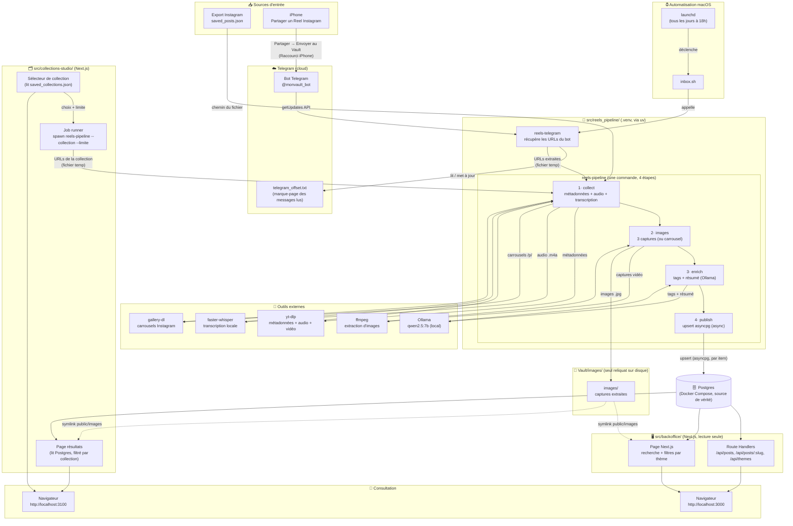
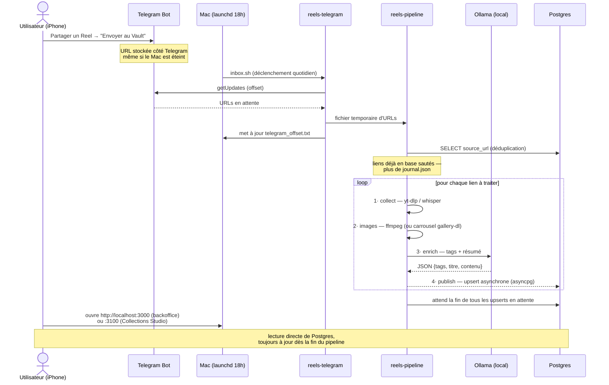
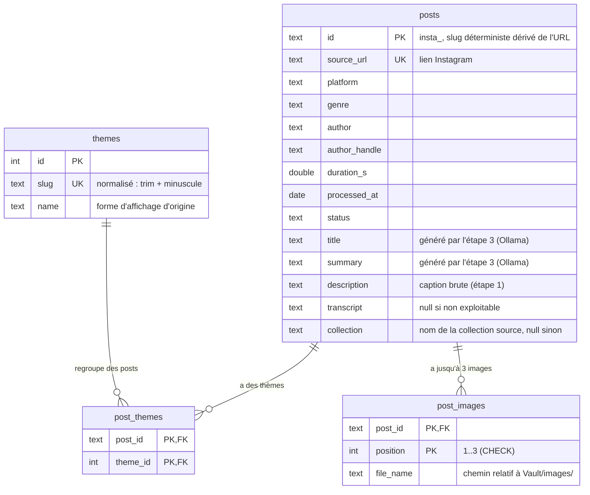

# Schéma du projet Reels Vault

Le projet a trois parties qui partagent une seule base de données Postgres :

1. **Le pipeline** (`src/reels_pipeline/`, Python) — collecte, transcrit, extrait des images, enrichit (tags + résumé) et **publie directement en base**, en 4 étapes internes (`collect.py` → `extract_images.py` → `enrich.py` → `publish.py`, orchestrées par `cli.py`), une seule commande (`reels-pipeline`).
2. **Le backoffice** (`src/backoffice/`, Next.js + Postgres) — lit cette base en direct et la sert via une page web et une API JSON. Ne fait plus aucun import/seed : la base est déjà à jour dès que le pipeline tourne.
3. **Collections Studio** (`src/collections-studio/`, Next.js) — permet de choisir une collection Instagram sauvegardée et de déclencher `reels-pipeline` dessus (limité, pour ne pas se faire repérer), puis affiche les résultats en lisant la même base.

Postgres est la seule source de vérité pour le contenu digéré. `Vault/` ne contient plus que les images extraites (`Vault/images/`) — plus de fiches `.md`, plus d'`index.md`, plus de `journal.json` (la reprise/dédoublonnage se fait désormais par une requête en base).

**Ce qui disparaît avec ce refacto** : `gallery.html` (page statique hors ligne) et l'intégration Obsidian (`reels-graph`) reposaient toutes les deux sur `index.md`/`raw/*.md` et sont supprimées — le backoffice et Collections Studio sont désormais les seules interfaces de consultation. Le dépôt sur Google Drive pour interroger le Vault depuis Claude mobile n'a plus de fichier à déposer non plus.

## Vue d'ensemble du workflow



---

## Cycle de vie d'une vidéo



---

## Modèle de données — Postgres

`src/backoffice/db/schema.ts` (Drizzle ORM) est l'autorité du schéma — le pipeline Python (`src/reels_pipeline/publish.py`) ne fait que des upserts dessus, jamais de migration. `posts.id` est le slug déterministe dérivé de l'URL (`insta_<ID>`, voir `_naming.identifiant()`), utilisé comme clé d'upsert.



Servi par `lib/queries.ts` (backoffice, utilisé à la fois par `app/page.tsx` et par les Route Handlers `app/api/*`) et par `lib/db.ts` (Collections Studio, une requête SQL dédiée filtrée par `collection`) :

- **`GET /api/posts`** — liste paginée, filtrable par `theme`/`q`, triée par `processed_at` décroissant
- **`GET /api/posts/:slug`** — détail d'un post
- **`GET /api/themes`** — thèmes triés par nombre de posts
- **Collections Studio** — mêmes tables, filtrées par `collection`, pas d'API exposée (lecture directe côté serveur)

---

## Structure des fichiers

```
reels-vault/                     ← racine du projet
├── src/
│   ├── reels_pipeline/           ← package Python (une étape par module, à plat)
│   │   ├── models.py             ← PipelineItem (porteur d'état en mémoire)
│   │   ├── collect.py            ← étape 1 : métadonnées + audio + transcription
│   │   ├── extract_images.py     ← étape 2 : extraction de 3 captures (ffmpeg)
│   │   ├── enrich.py             ← étape 3 : tags + résumé via Ollama local
│   │   ├── publish.py            ← étape 4 : upsert asyncpg dans Postgres
│   │   ├── cli.py                ← orchestrateur async, CLI reels-pipeline
│   │   ├── telegram.py           ← pont Telegram → reels-pipeline
│   │   ├── _ollama.py            ← client Ollama partagé
│   │   └── _naming.py            ← dérivation déterministe du slug depuis une URL
│   │
│   ├── backoffice/                ← Next.js + Postgres, lecture seule
│   │   ├── app/                   ← pages (App Router) + Route Handlers /api/*
│   │   ├── components/            ← galerie, recherche, filtres par thème
│   │   ├── db/                    ← schema.ts (Drizzle, autorité du schéma) + client Postgres
│   │   ├── lib/queries.ts         ← requêtes partagées page + API
│   │   ├── drizzle/               ← migrations SQL générées
│   │   ├── docker-compose.yml     ← Postgres, port 5433
│   │   └── public/images          ← symlink vers ../../../Vault/images
│   │
│   └── collections-studio/        ← Next.js, pick + trigger + résultats d'une collection
│       ├── lib/collections.ts     ← parse saved_collections.json
│       ├── lib/job-runner.ts      ← spawn reels-pipeline, job en mémoire
│       ├── lib/db.ts              ← requête SQL dédiée (postgres, sans Drizzle)
│       └── public/images          ← symlink vers ../../../Vault/images
│
├── pyproject.toml                ← dépendances + entry points reels-* (uv)
├── Makefile                      ← cibles Python (racine) + bo-* + cs-*
├── .env                          ← TOKEN + CHAT_ID (ignoré par git)
├── .env.example                  ← modèle à copier
├── .gitignore
│
└── Vault/                        ← ignoré par git
    ├── images/                   ← captures extraites des vidéos (seul contenu restant)
    └── telegram_offset.txt       ← dernier message Telegram lu
```
