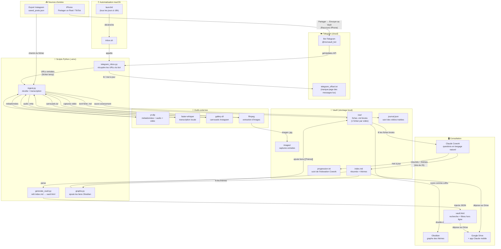
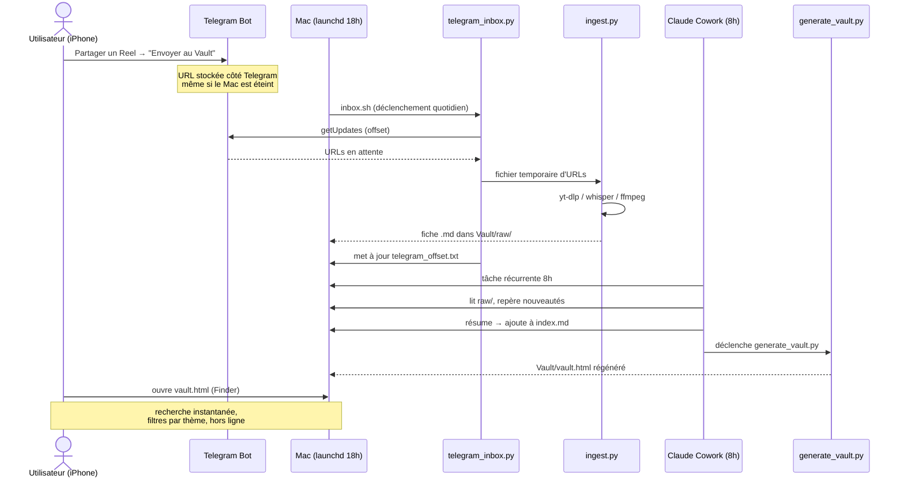

# Schéma du projet Reels Vault

## Vue d'ensemble du workflow



---

## Cycle de vie d'une vidéo



---

## Structure des fichiers

```
reels-vault/                    ← racine du projet
├── ingest.py                   ← récolte + transcription
├── telegram_inbox.py           ← pont Telegram → ingest.py
├── generate_vault.py           ← index.md → vault.html
├── graphe.py                   ← index.md → liens Obsidian
├── requirements.txt            ← dépendances pip
├── .env                        ← TOKEN + CHAT_ID (ignoré par git)
├── .env.example                ← modèle à copier
├── .gitignore
│
└── Vault/                      ← données (ignoré par git)
    ├── raw/                    ← fiches .md brutes (1 par vidéo)
    ├── images/                 ← captures extraites des vidéos
    ├── themes/                 ← notes de thèmes pour Obsidian
    ├── index.md                ← index résumé par Cowork
    ├── vault.html              ← page de consultation hors ligne
    ├── journal.json            ← vidéos déjà traitées par ingest.py
    ├── progression.txt         ← dernière fiche indexée par Cowork
    └── telegram_offset.txt     ← dernier message Telegram lu
```
