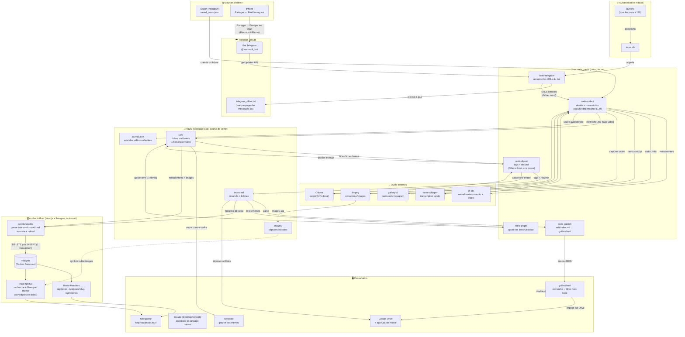
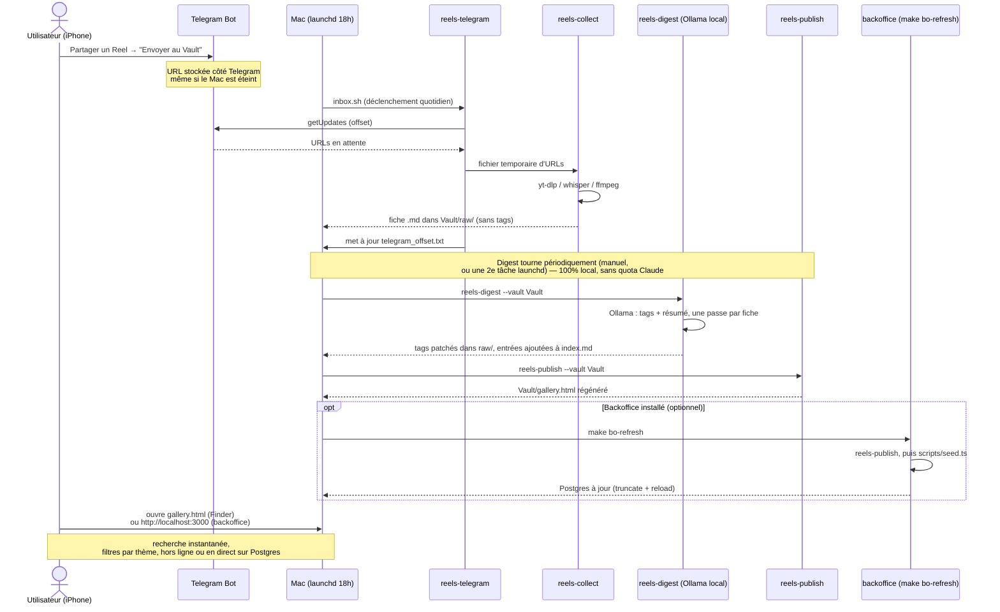
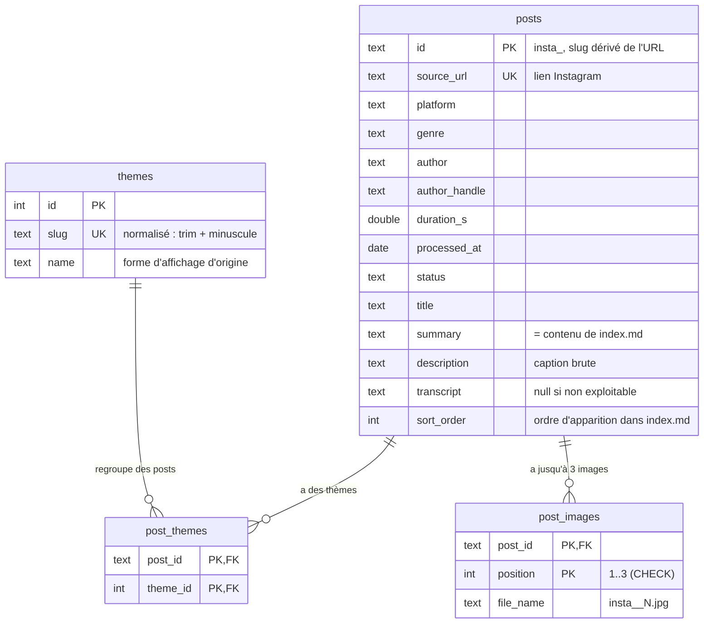

# Schéma du projet Reels Vault

Le projet a deux parties indépendantes qui partagent les mêmes données sur disque (`Vault/`) :

1. **Le pipeline** (`src/reels_vault/`, Python) — collecte, digère et publie les vidéos en fichiers plats.
2. **Le backoffice** (`src/backoffice/`, Next.js + Postgres, optionnel) — recharge ces mêmes fichiers dans une base de données et les sert via une page web et une API JSON.

Le pipeline reste la source de vérité ; le backoffice n'est qu'une vue alternative, rechargeable à tout moment (`make bo-refresh`).

## Vue d'ensemble du workflow



---

## Cycle de vie d'une vidéo



---

## Modèle de données — Backoffice (Postgres)

`src/backoffice/db/schema.ts` (Drizzle ORM). Rechargé en entier à chaque `make bo-db-seed` — `posts.id` est le slug dérivé de l'URL (`insta_<ID>`), stable d'un rechargement à l'autre.



Servi par `lib/queries.ts` (utilisé à la fois par `app/page.tsx` et par les Route Handlers `app/api/*`), lui-même consommé par :

- **`GET /api/posts`** — liste paginée, filtrable par `theme`/`q`
- **`GET /api/posts/:slug`** — détail d'un post
- **`GET /api/themes`** — thèmes triés par nombre de posts

---

## Structure des fichiers

```
reels-vault/                     ← racine du projet
├── src/
│   ├── reels_vault/              ← package Python (une phase par module)
│   │   ├── collect.py            ← récolte + transcription (aucune dépendance LLM)
│   │   ├── digest.py             ← tags + résumé via Ollama local
│   │   ├── publish.py            ← index.md → gallery.html
│   │   ├── graph.py              ← index.md → liens Obsidian
│   │   ├── telegram.py           ← pont Telegram → collect
│   │   ├── _ollama.py            ← client Ollama partagé (collect n'en dépend pas)
│   │   └── _naming.py            ← dérivation du nom de fiche depuis une URL
│   │
│   └── backoffice/               ← Next.js + Postgres (optionnel, isolé du pipeline Python)
│       ├── app/                  ← pages (App Router) + Route Handlers /api/*
│       ├── components/           ← galerie, recherche, filtres par thème
│       ├── db/                   ← schema.ts (Drizzle) + client Postgres
│       ├── lib/queries.ts        ← requêtes partagées page + API
│       ├── scripts/seed.ts       ← recharge Vault/ dans Postgres
│       ├── drizzle/              ← migrations SQL générées
│       ├── docker-compose.yml    ← Postgres, port 5433
│       └── public/images         ← symlink vers ../../../Vault/images
│
├── pyproject.toml                ← dépendances + entry points reels-* (uv)
├── Makefile                      ← cibles Python (racine) + cibles bo-* (backoffice)
├── .env                          ← TOKEN + CHAT_ID (ignoré par git)
├── .env.example                  ← modèle à copier
├── .gitignore
│
└── Vault/                        ← données (ignoré par git, source de vérité des deux côtés)
    ├── raw/                      ← fiches .md brutes (1 par vidéo)
    ├── images/                   ← captures extraites des vidéos
    ├── themes/                   ← notes de thèmes pour Obsidian
    ├── index.md                  ← index résumé, écrit par Digest
    ├── gallery.html              ← page de consultation hors ligne (pipeline)
    ├── journal.json             ← vidéos déjà collectées
    └── telegram_offset.txt       ← dernier message Telegram lu
```
